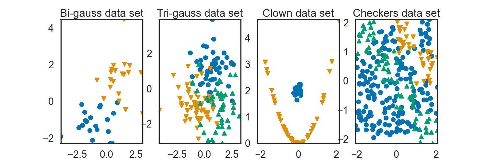
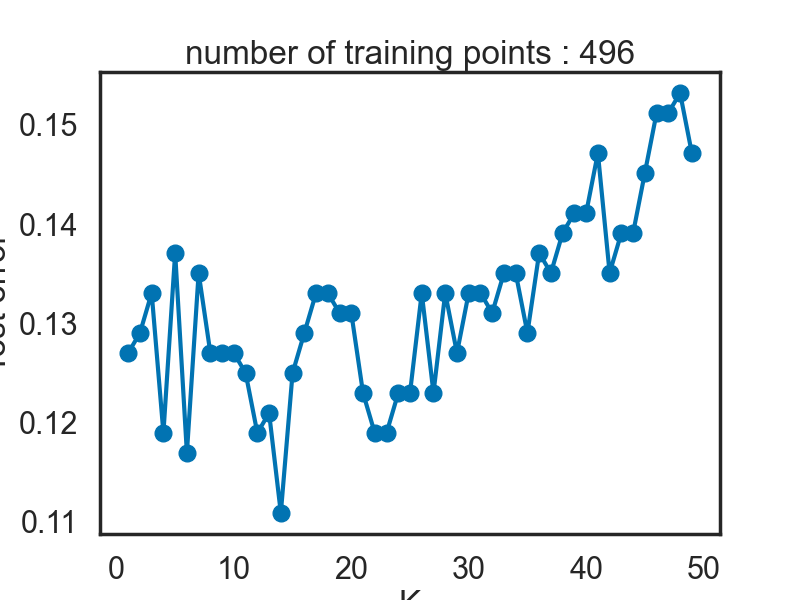

# TP1 : $k$-plus proches voisins

## Rappels de Classification
### Génération aritificielle de données

Dans le fichier `tp_knn_source.py`, nous avons à notre disposition des fonctions qui vont nous permettre de générer des datasets différents. Par exemple : 

- `rand_tri_gauss`: produit un échantillon issu de trois vecteurs gaussiens (de paramètres différents) appartenant à trois classes distinctes définies par les nombres 1,2 et 3. 

- `rand_clown`: produit un échantillon de deux variables différentes : `x_1` est un vecteur aléatoire formant une parabole à une erreur gaussienne près (groupe du sourire du clown=1) et `x_2` est la réalisation d'un vecteur gaussien (groupe du nez du clown=-1).

La dernière colonne correspond à la classe de la realisation $i$.
Pour mieux visualiser, voici un graphique tracé avec la fonction `plot2d` de `tp_knn_source.py` : 

<p align="center">
  
</p>

## La méthode

### Approche intuitive 

On peut essayer d'adapter la méthode dans un cadre de régression. Lorsque $\mathcal{Y}=\mathbb{R}$, on peut procéder de la même manière en sélectionnant les individus les plus proches de $x$, mais au lieu de compter la classe ayant le plus d'occurrence (ce qui n'a pas de sens ici), nous allons plutôt donner à l'élément $x$ la valeur correspondant à la moyenne de ses voisins.

### Approche formelle

Tout d'abord, nous allons compléter la classe `KNNClassifier` et comparer ses performances avec la classe `KNeighborsClassifier` de `scikit-learn`. Voici l'implémentation : 

```python
class KNNClassifier(BaseEstimator, ClassifierMixin):
    """Home made KNN Classifier class."""

    def __init__(self, n_neighbors=1):
        self.n_neighbors = n_neighbors

    def fit(self, X, y):
        self.X_ = X
        self.y_ = y
        return self

    def predict(self, X):
        n_samples, n_features = X.shape
        # We could compute all pairwise distances between X and self.X_ using metrics.pairwise.pairwise_distances
        dist = np.sum((X[:,np.newaxis,:]-self.X_[np.newaxis,:,:])**2, axis=-1)
        # Indices to sort them
        idx_sort = np.argsort(dist, axis=1)
        # Indices of neighbors
        idx_neighbors = idx_sort[:,:self.n_neighbors]
        # Labels of neighbors
        y_neighbors = self.y_[idx_neighbors]
        # The predicted labels y for each entry in X
        mode, _ = stats.mode(y_neighbors, axis=1)
        # the following might be needed for dimensionality
        y_pred = np.asarray(mode.ravel(), dtype=np.intp)
        return y_pred

```

Les performances des deux méthodes sont données dans le tableau ci-dessous à l'aide de `rand_tri_gauss`: 

| Classe  | KNNClassifier          | KNeighborsClassifier |
| :------------|:-------------:| :-------------:|
| Performance  |   0.813        |    0.813 |


On voit ici que les performances sont assez similaires, mais à partir de maintenant nous utiliserons la classe de `scikit-learn` pour gagner en temps de calcul.

Voici, dans le cas de `rand_checkers`, ce que donne l'algorithme pour `n_neighbors=5` : 

<p align="center">
  
</p>

Nous avons calculé ce que donne la méthode pour différentes valeurs du nombre de voisin. On obtient les régions suivantes : 

<p align="center">
  
</p>

On peut s'intéresser aux cas extrêmes où :
- $k=1$ : il suffit de regarder la classe de l'individu le plus proche.
- $k=n$ : tous les individus possèdent la classe qui apparait le plus souvent dans nos données d'apprentissage.

Les voici tracés :

<p align="center">
  
</p>

On peut remarquer par ailleurs en regardant l'image pour différentes valeurs du nombre de voisin que plus celui-ci diminue, plus la frontière entre les classes devient complexe : on gagne en biais ce que l'on va perdre en variance. Il nous faut donc trouver un compromis pour trouver le nombre de voisin optimal.

Pour ce faire, nous allons utiliser la classe `ErrorCurve` fournie dans `tp_knn_source.py` pour tracer la courbe d'erreur en fonction du paramètre $k$. Voici ce que l'on obtient `rand_checkers` lorsque la taille de l'échantillon vaut 1000.

<p align="center">
  
</p>

Ici, on voit que le nombre de voisin optimal est de $13$. En réiterant ce procédé pour d'autres valeurs de la taille de l'échantillon et d'autres datasets, on remarque que la valeur de ce $k$ optimal change.

Cette méthode est très intuitive, géométriquement. Cependant, on peut rapidement se perdre surtout au niveau de l'interprétation, lorsque la dimension de nos vecteurs est supérieure à 4. De plus, on peut voir aussi que nous avons $n$ calcul de distance à faire lorsque $n$ est la taille de l'échantillon, ce qui peut prendre un temps considérable lorsque ce dernier est grand (en plus de l'agrégation à la classe). 

Mais malgrès ces défauts, ce classifieur reste un outil puissant lorsque l'on reste en petite dimension !

Appliquons maintenant cette méthode dans un cadre plus concret. Nous allons considérer la base de données DIGITS : il s'agit d'image représentant des chiffres, la classe de l'image correspondant au chiffre écrit. Traçons tout d'abord la courbe de précision pour différentes valeurs de $k$ : 

<p align="center">
  
</p>

Un moyen de visualiser aussi la performance de notre méthode est de regarder la confusion. Cette denière est définie par 

$$
M_{i,j} = (\mathbb{P}(Y=i, C_k(X)=j))_{i,j}
$$

On peut l'estimer à l'aide de `scikit-learn` avec la fonction `metrics.confusion_matrix`. Voici ce que l'on obtient : 

<p align="center">
  
</p>

On constate des valeurs très élevées sur la diagonale ce qui signifie que notre classifieur est assez performant ici (on a pris le cas où le nombre de voisin vaut 3).


La grande question est maintenant de savoir quel $k$ choisir. Pour cela, nous allons faire de la validation croisée sur différentes valeurs de $k$, avec l'algorithme "leave-$p$-out". On a accès à la classe `LOOCurve` dans `tp_knn_source.py` qui calcule la courbe d'erreur avec cet algorithme. Voici la courbe obtenue : 

<p align="center">
  
</p>

On voit ici qu'il n'est pas nécessaire de regarder plus qu'un seul voisin, ce qui peut s'expliquer par la grande dimension du vecteur des données (vu qu'il s'agit d'images).
