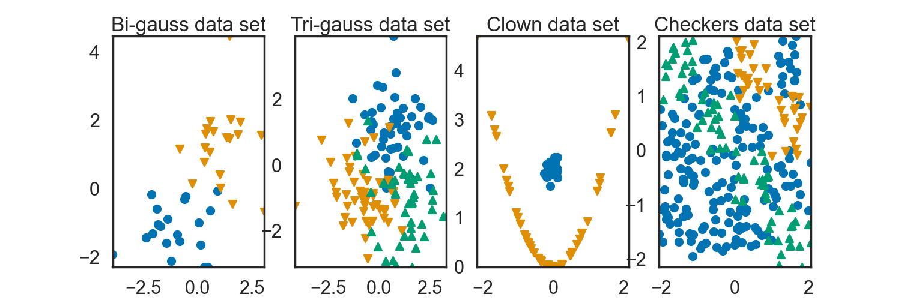

# TP1 : $k$-plus proches voisins

## Rappels de Classification
### Génération aritificielle de données

Dans le fichier `tp_knn_source.py`, nous avons à notre dispositions des fonctions qui vont nous permettre de générer des dataset différents. Par exemple : 

- `rand_tri_gauss`: produit un échantillon issue de trois vecteurs gaussien (de paramètres différents) appartenant à trois classes distinctes définies par les nombres 1,2 et 3. 

- `rand_clown`: produit un échantillon de deux variables différentes : `x_1` est un vecteur aléatoire formant une parabole à une erreur gaussienne près(groupe du sourire du clown=1) et `x_2` est la réalisation d'un vecteur gaussien (groupe du nez du clown=-1).

La dernière colonne correspond à la classe de la realisation $i$.
Pour mieux visualiser, voici un graphique tracé avec la fonction `plot2d` de `tp_knn_source.py` : 

{width=75%}

## La méthode

### Approche intuitive 

On peut essayer d'adapter la métthode dans un cadre de régression. Lorsque $\mathcal{Y}=\mathbb{R}$, on peut procéder de la même manière en sélectionnant les individus les plus proches de $x$, mais au lieu de compter la classe ayant le plus d'occurrence (ce qui n'a pas de sens ici), nous allons plutôt donné à l'élément $x$ la valeur correspondant à la moyenne de ses voisins.

### Approche formelle

Tout d'abord nous allons compléter la classe `KNNClassifier` et comparer ses performances avec la classe `KNeighborsClassifier` de `scikit-learn`. Voici l'implémentation : 

```{python}
class KNNClassifier(BaseEstimator, ClassifierMixin):
    """Home made KNN Classifier class."""

    def __init__(self, n_neighbors=1):
        self.n_neighbors = n_neighbors

    def fit(self, X, y):
        self.X_ = X
        self.y_ = y
        return self

    def predict(self, X):
        n_samples, n_features = X.shape
        # We could compute all pairwise distances between X and self.X_ using metrics.pairwise.pairwise_distances
        dist = np.sum((X[:,np.newaxis,:]-self.X_[np.newaxis,:,:])**2, axis=-1)
        # Indices to sort them
        idx_sort = np.argsort(dist, axis=1)
        # Indices of neighbors
        idx_neighbors = idx_sort[:,:self.n_neighbors]
        # Labels of neighbors
        y_neighbors = self.y_[idx_neighbors]
        # The predicted labels y for each entry in X
        mode, _ = stats.mode(y_neighbors, axis=1)
        # the following might be needed for dimensionality
        y_pred = np.asarray(mode.ravel(), dtype=np.intp)
        return y_pred

```

Les performances des deux méthodes sont données dans le tableau ci-dessous : 

| Classe  | KNNClassifier          | KNeighborsClassifier |
| :------------|:-------------:| :-------------:|
| Performance  |   0.813        |    0.813 |


Rajouter une dimension 
```
import numpy
X = np.random.rand(100,2)
X[:,np.newaxis,:]
```