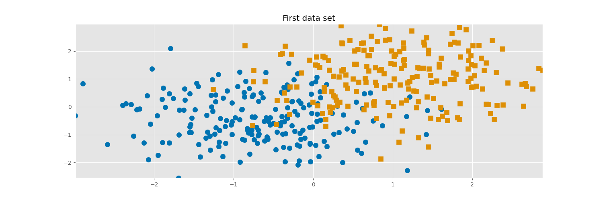
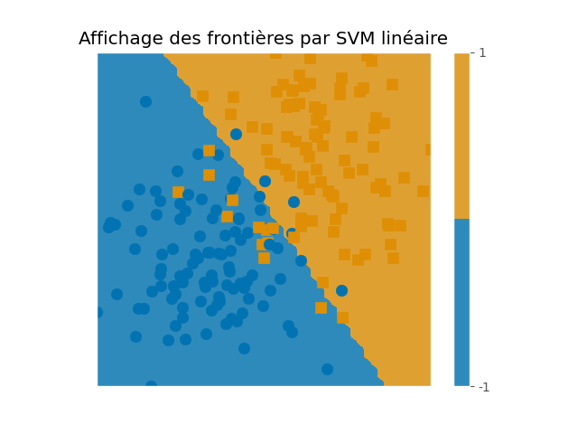
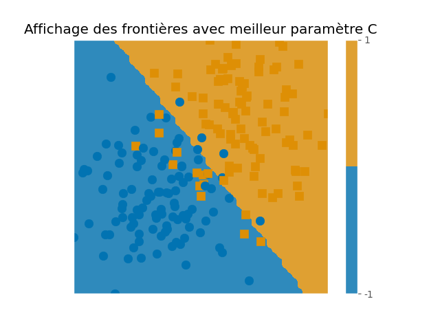
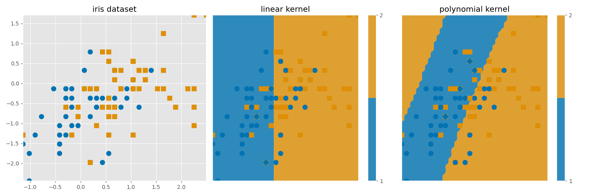
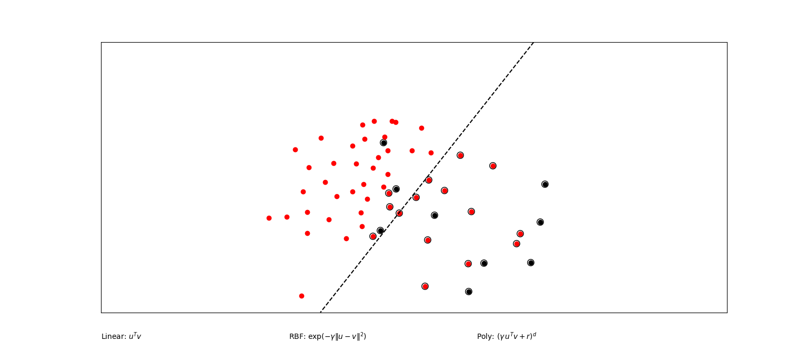
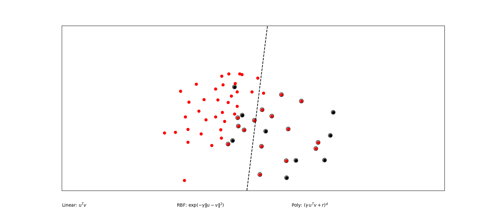
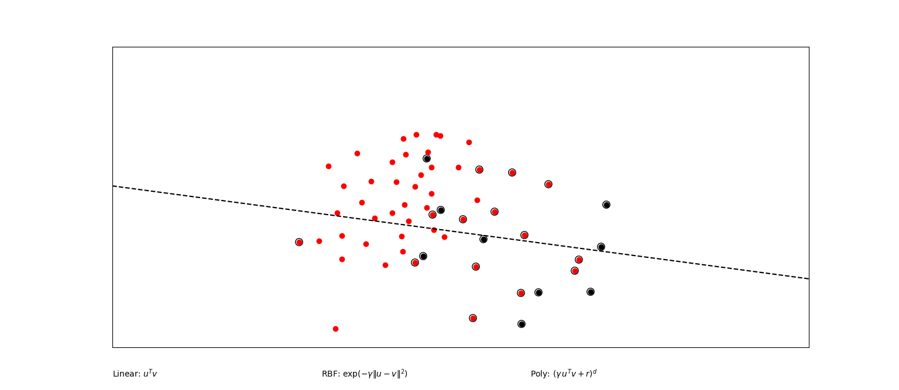
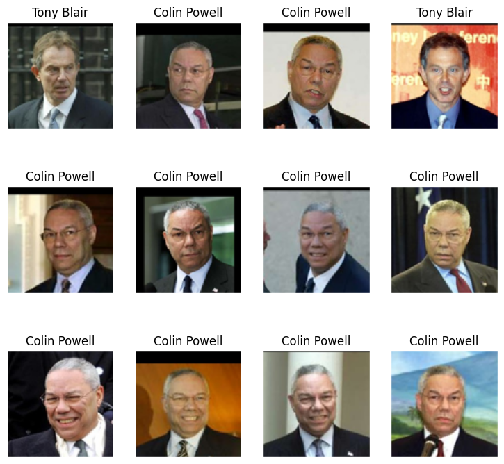
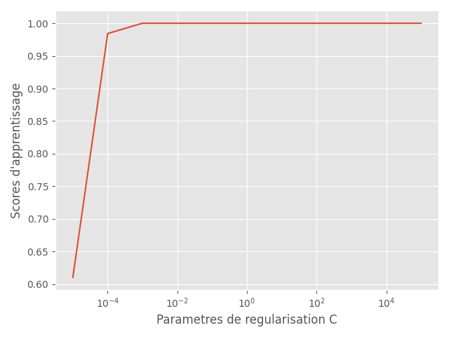

# TP3 6 Support vector machine


Dans ce TP, nous allons apprendre à générer nos premières classifications avec classifieurs SVM. 


## Premières mises en oeuvres

### Données simulées

Regardons un premier exemple jouet avec des données de simulation. On utilisera notre fonction `rand_bi_gauss` pour pouvoir effectuer nos simulations.

Pour pouvoir calculer nos classifieurs, nous utiliserons la fonction `SVC` du package `scikit-learn` : 

```python
from sklearn.svm import SVC
```

Nous avons alors simulé un échantillon de taille 400, où les classes sont bien équilibrées (`n1=200` et `n2=200`). Voici les points obtenus : 

<p align="center">
  
</p>


Nous allons donc chercher à calculer le classifieur `SVM` en utilisant un noyau linéaire. Voici la frontière obtenue : 

<p align="center">
  
</p>


On rappelle par ailleurs que le classifieur se calculant en trouvant le solution du programme suivant : 

$$
\begin{cases} 
(w^*, w_0^*, \xi^*) & \in \arg \min_{w \in \mathcal{H}, w_0 \in \mathbb{R}, \xi \in \mathbb{R}^n}\Big( \frac{1}{2} ||w||^2 + C \sum_{i=1}^n\xi_i \Big) \\
s.c. &\xi_i \ge 0 \\
&y_i(\langle w, \phi (x_i)\rangle +w_0) \ge 1-\xi_i
\end{cases}
$$

où $\mathcal{H}$ est un espace hilbertien. 

On voit ici qu'il y a un paramètre $C$, à ajuster,  qui va controler la complexité du classifieur. Il est déjà intégrer dans la classe `SVC` et dans le graphique précédent, nous avons utiliser le paramètre par défaut c'est à dire $C=1$. On pourrait alors se demander directement, si on ne peut pas améliorer notre qualité de prédiction avec un bon choix de $C$ : pour cela, nous allons utiliser la classe `GridSearchCV`, nous permettant de sélectionner le $C$ optimal (sur une grille déterminée au préalable) par validation croisée.

On obtient alors la frontière suivante :

<p align="center">
  
</p>

On voit que les frontières n'ont pas tant évoluées ici... On peut alors s'amuser à regarder la valeur du score de prédiction pour nos deux modèles (on a fixé une graine à 20):

| $C$  |1.0    | 0.15095 |
| :------------|:-------------:| :-------------:|
| Performance  |   0.885 | 0.89 |


On voit  ici que les performances sont finalement assez similaire, même si les valeurs de $C$ sont assez éloignées.


### Classification sur données réelles : le datasete `iris`


Maintenant que nous avons pu bien prendre en main notre classifieur, regardons ses performances sur un célèbre dataset utilisé en machine learning : le dataset `iris`. Ce dataset décrit les caractéristiques de 3 espèces de fleurs avec quatre variables quantitatives décrivant l'aspect phyisique de chaque plante.


Ici, nous allons utilisé uniquement les classes 1 et 2 du dataset pour rester dans un cadre de classification binaire. Seulement cette fois, nous n'allons pas comparer les performances pour deux valeurs de $C$ différentes, mais nous allons comparer les performances pour deux noyaux différents : un noyau linéaire et un noyau polynomial.

Bien sur, les paramètres $C$ et $\alpha$ et $\delta$ (dans le noyau polynomial) seront déterminé par validation croisée grâce à la classe `GridSearchCV`. On obtient alors les frontières suivantes :

<p align="center">
  
</p>


On remarque ici que les frontières données par le modèle avec noyau polynômiale sont plus complexes que celles données par le noyau linéaire : cela s'explique par le fait que le noyau polynômial utilise un espace hilbertien plus complexe pour déterminer les frontières. Ainsi, ce classifieur va pouvoir capter plus d'information que l'autre. Néanmoins, on remarque ici que ce n'est pas forcément nécessaire : en effet, le noyau linéaire fournit un score de prédiction équivalent (et même un peu meilleur) que le noyau polynomial (0.55 pour le linéaire contre 0.5 pour le polynômial). Ainsi, on préfèrera utiliser le noyau linéaire issu étant plus simple avec des performances équivalentes.

## SVM GUI

Le script `svm_gui.py` est une application permettant d'évaluer en temps réel l'impact du choix de noyau et du pramètre de régularisation $C$. Voici comment se présente l'application : 

<p align="center">
  
</p>

Pour utiliser l'application, il suffit de cliquer sur le plan (click gauche pour la classe rouge et click droit pour la classe noire) et ensuite d'appuyer sur le bouton `fit` pour obtenir le classifieur. On voit que l'on peut utiliser trois noayux différents : noyau linéaire, le noyau polynomial et le noyau Gaussien radial (ou RBF). 

**Instabilité des solutions**

Nous allons montrer ici que dans le cas où le jeu de données est très déséquilibré (par exemple une classe qui représente 90% des données), on peut voir que le SVM par noyau linéaire peut devenir très instable en fonction du paramètre $C$. Voici le classifieur obtenu dans le cas où $C=1$ : 

<p align="center">
  
</p>

On voit ici que la taille de marge est assez petite, et que le classifieur possède une erreur d'apprentissage assez élevée. Seulement, regardons les nouveaux classifieurs pour des valeurs de C plus petites (ici respectivement 0.8, 0.4 et 0.1) :

<p float="center">
  
   
  
</p>

On constate ici que la séparation effectuée par le classifieur est très variable, notamment pour le dernier cas où la droite a pivoté de 90 degrés. 


## Classification des visages

Nous allons maintenant étudier plusieurs effets qui peuvent survenir en pratique. Nous allons pour cela étudier le cas de classifications de visages avec la base de données `fetch_lwd_people` disponible aussi dans la librarie `sklearn.datasets`. Elle contient des images de personnalités politiques américaine.

Pour rester dans un cadre simple, nous allons nous contenter de classifier deux classes d'images : celles de Tony Blair et celles de Colin Powell

```python
# Chargement des données
lfw_people = fetch_lfw_people(min_faces_per_person=70, resize=0.4,
                              color=True, funneled=False, slice_=None,
                              download_if_missing=True)

# Sélection des classes
names = ['Tony Blair', 'Colin Powell']
idx0 = (lfw_people.target == target_names.index(names[0]))
idx1 = (lfw_people.target == target_names.index(names[1]))
images = np.r_[images[idx0], images[idx1]]
n_samples = images.shape[0]
y = np.r_[np.zeros(np.sum(idx0)), np.ones(np.sum(idx1))].astype(int)
```

<p align="center">
  
</p>


### Influence du paramètre de régularisation

Nous allons maintenant étudier l'influence du paramètre $C$ pour notre classifieur. Pour cela, nous allons d'abord regarder l'erreur sur l'échantillon d'apprentissage. On obtient alors : 


<p align="center">
  
</p>

Le graphique nous montre ici que le score d'apprentissage est croissant en les valeurs de $C$ jusqu'à tendre vers 1 : cette tendance est totalement cohérente avec la nature de la pénalité. En effet, cette dernière pénalise l'erreur que l'on se permet dans la classification des données d'apprentissage : ainsi dès que $C$ va devenir trop grand, les erreurs permises vont diminuer jusqu'à devenir nulle (i.e. $\xi_i =0, \forall i$).

Cependant, on voit bien que cette surpénalisation va entraîner la construction de frontière trop complexe (soit une trop grosse variance) et va donc accroître le risque de sur-apprentissage. 


### Présence de variables de nuisances

Souvent, il arrive que les données que nous avons à classer sont trop nombreuses, voire que certaines d'entre elles ne donnent pas vraiment d'information sur le problème que l'on cherche à résoudre : on parle de variable de bruits. Nous allons voir ici que la présence de ces dernières peuvent faire drastiquement chuter la performance d'un classifieur SVM. 

Pour le montrer, nous allons rajouter à nos données d'apprentissage 300 pixels de bruits, suivant une loi normale centrée réduite avec le code suivant :

```python 
# On rajoute des variables de nuisances aux données X
sigma = 1
noise = sigma * np.random.randn(n_samples, 300, )
X_noisy = np.concatenate((X, noise), axis=1)
X_noisy = X_noisy[np.random.permutation(X.shape[0])]
```

Ainsi, nous pouvons calculer les performances prédictions de ce modèle avecc variables de bruits et les comparer avec celles du modèles simple (les calculs seront fait avec la fonction `run_svm_cv` disponible dans le fichier `script_svm.py`) :


| Modèles  | Sans variables de bruit   | Avec variables de bruit |
| :------------|:-------------:| :-------------:|
| Performance apprentissage |   1.0 | 0.8947 |
| Performance test |   0.9947  | 0.5578 |


On voit ici que les performances ont drastiquement diminuées : pire, si on considère la méthode dite de la classe majoritaire (classifieur donnant pour chaque donnée la classe la plus nombreuse), notre classifieur a une performance moins bonne que cette stratégie (ce qui n'est au final pas très intéressant).


Un moyen de contourner ce problème est d'effectuer de la réduction de dimension. Une méthode bien connu consiste à sélectionner des directions riches en informations dans le sous-espace engendré par les variables : il s'agit de l'analyse en composante principale.

Pour ce faire, nous allons utiliser la classe `PCA` de `sklearn.decomposition` 