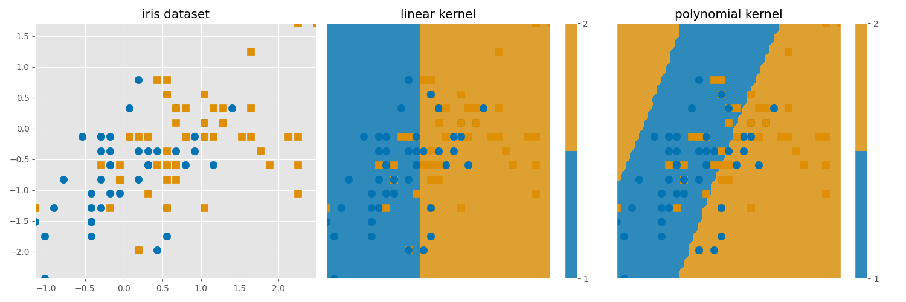

# TP3 6 Support vector machine


Dans ce TP, nous allons apprendre à générer nos premières classifications avec classifieurs SVM. 


## Premières mises en oeuvres

### Données simulées

Regardons un premier exemple jouet avec des données de simulation. On utilisera notre fonction `rand_bi_gauss` pour pouvoir effectuer nos simulations.

Pour pouvoir calculer nos classifieurs, nous utiliserons la fonction `SVC` du package `scikit-learn` : 

```python
from sklearn.svm import SVC
```

Nous avons alors simulé un échantillon de taille 400, où les classes sont bien équilibrées (`n1=200` et `n2=200`). Voici les points obtenus : 

<p align="center">
  
</p>


Nous allons donc chercher à calculer le classifieur `SVM` en utilisant un noyau linéaire. Voici la frontière obtenue : 

<p align="center">
  
</p>


On rappelle par ailleurs que le classifieur se calculant en trouvant le solution du programme suivant : 

$$
\begin{cases} 
(w^*, w_0^*, \xi^*) & \in \arg \min_{w \in \mathcal{H}, w_0 \in \mathbb{R}, \xi \in \mathbb{R}^n}\Big( \frac{1}{2} ||w||^2 + C \sum_{i=1}^n\xi_i \Big) \\
s.c. &\xi_i \ge 0 \\
&y_i(\langle w, \phi (x_i)\rangle +w_0) \ge 1-\xi_i
\end{cases}
$$

où $\mathcal{H}$ est un espace hilbertien. 

On voit ici qu'il y a un paramètre $C$, à ajuster,  qui va controler la complexité du classifieur. Il est déjà intégrer dans la classe `SVC` et dans le graphique précédent, nous avons utiliser le paramètre par défaut c'est à dire $C=1$. On pourrait alors se demander directement, si on ne peut pas améliorer notre qualité de prédiction avec un bon choix de $C$ : pour cela, nous allons utiliser la classe `GridSearchCV`, nous permettant de sélectionner le $C$ optimal (sur une grille déterminée au préalable) par validation croisée.

On obtient alors la frontière suivante :

<p align="center">
  
</p>

On voit que les frontières n'ont pas tant évoluées ici... On peut alors s'amuser à regarder la valeur du score de prédiction pour nos deux modèles (on a fixé une graine à 20):

| $C$  |1.0    | 0.15095 |
| :------------|:-------------:| :-------------:|
| Performance  |   0.885 | 0.89 |


On voit  ici que les performances sont finalement assez similaire, même si les valeurs de $C$ sont assez éloignées.


### Classification sur données réelles : le datasete `iris`


Maintenant que nous avons pu bien prendre en main notre classifieur, regardons ses performances sur un célèbre dataset utilisé en machine learning : le dataset `iris`. Ce dataset décrit les caractéristiques de 3 espèces de fleurs avec quatre variables quantitatives décrivant l'aspect phyisique de chaque plante.


Ici, nous allons utilisé uniquement les classes 1 et 2 du dataset pour rester dans un cadre de classification binaire. Seulement cette fois, nous n'allons pas comparer les performances pour deux valeurs de $C$ différentes, mais nous allons comparer les performances pour deux noyaux différents : un noyau linéaire et un noyau polynomial.

Bien sur, les paramètres $C$ et $\alpha$ et $\delta$ (dans le noyau polynomial) seront déterminé par validation croisée grâce à la classe `GridSearchCV`. On obtient alors les frontières suivantes :

<p align="center">
  
</p>


FINIR 

## SVM GUI

Le script `svm_gui.py` est une application permettant d'évaluer en temps réel l'impact du choix de noyau et du pramètre de régularisation $C$.


<p float="center">
  
   
  
</p>


